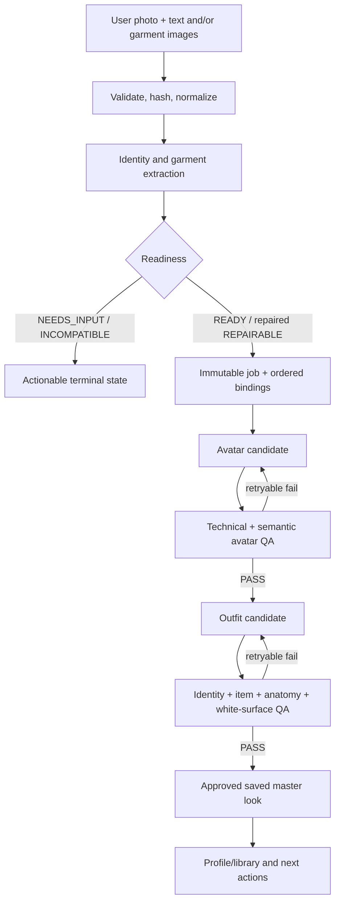

# Architecture and pipelines

## Repository and deployment topology

```text
edwin0912-00/zeely-ai-engineering-test (private, branch beta)
├── web/public/                 engineering beta UI
├── src/                        engine, APIs, providers, QA and persistence
├── tools/                      verification and release tooling
├── spec/ + docs/               contracts and evidence
└── runtime (outside Git)       private users, runs, receipts and media

edwin0912-00/wardrobe-web2 (public, branch main)
├── cinematic main UI
├── same-origin /api/* adapter/proxy
└── installation/reviewer wrapper

Public routing
├── beta.madeforthisjob.com     beta UI + beta engine
└── madeforthisjob.com          cinematic UI; /api/* → same beta engine
```

There are three deployable modules even if they later move into one monorepo:

1. cinematic main frontend;
2. engineering beta frontend;
3. shared generation/QA/profile engine.

Never overwrite the cinematic UI with `web/public`, and never claim that the
public frontend repository alone contains the engine. The planned unified
monorepo should import exact histories without submodules and bind all three
modules in one release lock; it is not yet the canonical repository topology.

## Core execution graph



## Pipeline blocks

### PROFILE

Browser-owned profile with a server cookie, avatars, looks, scenes, shoots and
videos. The default lifetime is 30 days. God View is an explicit engineering
test mode that aggregates all sessions; it must not become a production privacy
default.

### LOOK

```text
upload → conditioning → garment conflict selection → avatar → avatar QA
→ outfit → outfit QA → exact-white master → save/reuse/add items
```

Conditioning converts poor references into evidence packs without changing
observable logo, text, colour, silhouette, construction or material. Concurrent
garment preparation is allowed; avatar and final outfit remain dependency-bound.

### BACKGROUND

```text
saved master look → choose one std.* preset → immutable SceneSpec
→ generate one native 3:4 image → identity/items/scene/light/framing QA
→ persist result or retry only scene stage
```

The current catalog exposes 16 presets. A background is not a style pack and
does not inherit Fashion Shoot semantics.

### FASHION SHOOT

```text
saved master look → choose one shoot.* style → bind immutable Create Universe pack
→ internal identity/look prerequisite → generate 5 unique frames
→ per-frame identity/item/style/framing QA → independent retry → saved shoot
```

The style pack owns environment, lighting, optics, grade, composition, pose
language and negative constraints. Creative/reference/contact sheets are backend
conditioning authority, not a sixth customer photograph and not a mandatory
approval screen.

### FASHION VIDEO

```text
saved master look + verified motion/style reference
→ choose motion mode/surface → immutable provider create receipt
→ async wait/resume → technical video QA → semantic identity/item/reference QA
→ optional bounded salvage/retry → persisted clip
```

Canonical motion modes: editorial micro-moment, camera drift, walk/stride and
garment gesture. The source performer from a motion reference must never leak
into delivery.

### BACKGROUND VIDEO

```text
approved background frame → product focus OR posing
→ simpler locked-background motion request → QA → clip
```

This remains distinct from Fashion Video and Fashion Shoot.

### REAL-TIME LOOK

```text
saved master look → camera permission → local preview
→ optional explicit price/processing consent → short-lived token
→ bounded WebRTC transformation → Stop/Capture → explicit Save
```

No camera permission on page load. No hidden recording. A delayed captured-frame
generation is labelled delayed preview, never “real-time”.

### PRESENTATION

Optional cinematic shell:

```text
wardrobe with two mirrors → TV fashion result → laptop pipeline/deck → thanks
```

Swipe/scroll may control video time deterministically. UI copy stays accessible
DOM, with reduced-motion/poster fallback. Presentation never substitutes for
core evidence or engine installation.

## Persistence and recovery

- Immutable job + input hashes establish execution identity.
- Provider `create` response is journalled atomically before waiting.
- Refresh/restart resumes the recorded remote job; it does not create a duplicate.
- SSE is preferred for progress; polling is the recovery transport.
- Results are projected into the profile without moving or mutating immutable
  source evidence.
- Each scene, shoot frame and video clip has its own retry/delete address.
- Cross-shoot deletion must only touch execution identities derived from the
  current shoot.

## Release truth

```text
commit with focused behavior test
→ integration/source branch
→ exact-SHA release artifact
→ deploy/activate
→ public health confirms release SHA
→ real browser journey confirms behavior
```

Only the final step proves E2E. A unit test, catalog response, provider preflight
or healthy server proves a smaller fact.
