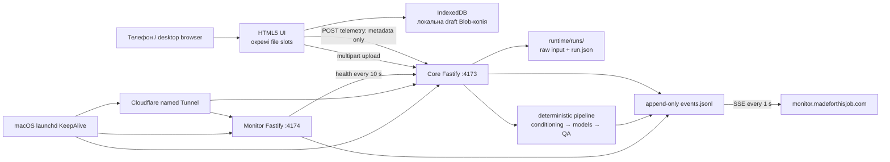

# ZEELY — persistence та live monitoring

## Наскрізна схема

## Що робить кожен ресурс

| Ресурс | Відповідальність | Що зберігає | Як видно failure |
|---|---|---|---|
| Browser file slots | Person, identity detail і garments не перезаписують один одного. Garment picker додає до попереднього selection. | `File` objects під час відкритої вкладки. | Preview і кількість файлів оновлюються після кожної дії. |
| Browser IndexedDB | Копіює вибрані файли як Blob, text outfit і scene toggle після кожної зміни. Відновлює їх після reload/browser crash. | Тільки на конкретному пристрої й origin `madeforthisjob.com`; consent не зберігається. | UI показує “збережено”, “відновлено” або локальну помилку quota/storage. `client.draft_*` іде в monitor. |
| `boot-guard.js` | Підключається до module app і ловить ранній `error`, `unhandledrejection`, boot timeout. | Нічого, крім telemetry metadata. | Замість білого екрана показує видимий reload-card; draft при цьому не очищується. |
| Core Fastify `:4173` | Optional server PIN gate, static UI, multipart intake, run API, run SSE, client telemetry endpoint. | Run inputs/state у `runtime/runs`; telemetry — у спільний event log. | Кожен API response, server exception і факт повного отримання upload пишеться в журнал. |
| `RunService` / runner | Запускає checkpointed pipeline і публікує лише фактичні phase changes. | `run.json`, artifacts, receipts, QA evidence. | UI показує `UPLOAD`, доки сервер не створив run; потім реальні `1/8…8/8`, без таймера або synthetic percent. |
| Event store | Append-only операційна історія, доступна одночасно core та monitor process. | `runtime/monitor/events.jsonl`, permissions `0600`. | Пошкоджений одиничний рядок ігнорується під час tail; нові записи не перезаписують старі. |
| Monitor Fastify `:4174` | Читає tail, транслює SSE, перевіряє `:4173/api/health` кожні 10 секунд. | Тільки оперативний status у RAM; event history лишається у JSONL. | Dashboard окремо показує monitor health та core health; SSE сам reconnect-иться. |
| macOS LaunchAgents | Тримають core, monitor і tunnel трьома незалежними процесами. | launchd state/logs. | `KeepAlive` перезапускає process; stderr залишається у `runtime/logs`. |
| Cloudflare Tunnel | Публікує studio та monitor без inbound port/router configuration. | Project-scoped tunnel credential поза Git. | Cloudflare endpoint повертає 502/503, а monitor watchdog фіксує core down, якщо origin недоступний. |

## Реальний порядок подій одного запуску

1. `client.file_selected` — браузер прийняв selection; передається лише count/bytes.
2. `client.draft_saved` — IndexedDB commit завершився.
3. `client.submit` — користувач натиснув запуск; run ID ще немає.
4. `run.upload_received` — сервер дочитав multipart повністю. Якщо цієї події немає, збій був до intake.
5. `http.response POST /api/runs 202` і `client.submit_response` — run створено, відомий `run_id`.
6. `run.phase` — persisted server phases; браузер отримує їх через run SSE.
7. `client.run_event` — підтверджує, що UI реально побачив phase.
8. `COMPLETED`, `NEEDS_INPUT` або `FAILED` — terminal truth із повідомленням, outputs/evidence або точним failure reason.

## Privacy boundary

Allowlist client telemetry приймає тип події, timestamp, випадковий session ID, run ID, status/stage, duration, кількість і сумарний byte size. Вона відкидає назви файлів, contents, image previews, outfit text, PIN, cookies та довільні поля. На час відкритого тестування dashboard доступний без PIN; серверний PIN gate збережений у коді й може бути повернений через runtime configuration.

## Публічні точки перевірки

- Studio: `https://www.madeforthisjob.com`
- Monitor: `https://monitor.madeforthisjob.com`
- Studio health: `https://www.madeforthisjob.com/api/health`
- Monitor health: `https://monitor.madeforthisjob.com/api/health`

Наразі UI та operational API відкриті без PIN. Health endpoints також public для uptime probing і не повертають secrets.
