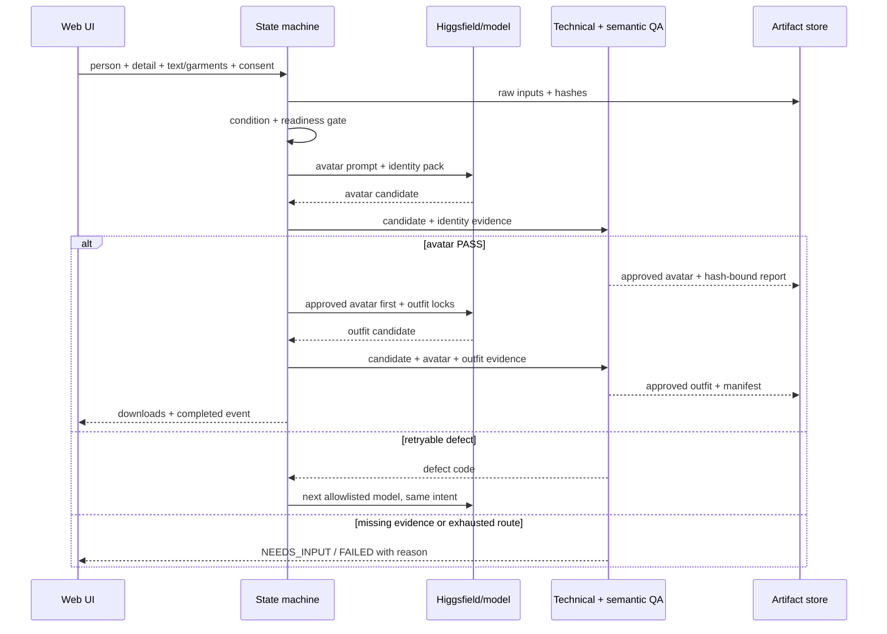
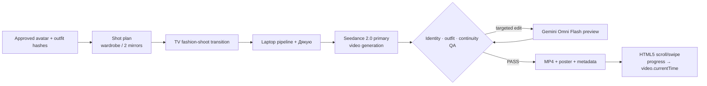

# ZEELY — схема working test pipeline

Версія: `1.0.0`  
Статус: описує реалізоване ядро та окремо — незапущене presentation extension.  
Source of truth: [`spec/ZEELY_CANON_UA.md`](../spec/ZEELY_CANON_UA.md), [`plans/zeely-test.pipeline.json`](../plans/zeely-test.pipeline.json), [`config/model-policy.json`](../config/model-policy.json).

## 1. Що отримує користувач

Користувач відкриває PIN-захищений сайт, завантажує основне фото людини, за потреби додатковий identity reference, описує новий образ текстом і/або додає до п’яти фото речей. Один run послідовно повертає:

1. `avatar.png` — затверджений базовий аватар тієї самої людини на точному білому фоні.
2. `avatar_outfit.png` — той самий затверджений аватар у заданому образі.
3. `art_director_scene.png` — optional bonus, лише після PASS двох core-зображень.
4. `run-manifest.json`, точні prompts, hashes, events і QA evidence.

Для обов’язкової здачі запускаються три fixtures, тому minimum submission — шість PNG: `001..003/avatar.png` і `001..003/avatar_outfit.png`.

## 2. Наскрізна схема

```mermaid
flowchart LR
    U["1 · Web UI\nФото людини · identity detail\nтекст і до 5 фото речей"]
    I["2 · Fastify intake\nconsent · MIME · 20 MB/file\ndecode · dimensions"]
    S["3 · Immutable source store\nraw bytes · SHA-256\nisolated run directory"]
    X["4 · Garment extraction\nCodex VLM strict JSON\nOBSERVED · UNKNOWN"]
    C["5 · Reference Conditioning\nSharp + bounded transforms\nsRGB · crops · cutout · white card"]
    G{"6 · Readiness gate\nREADY / REPAIRABLE\nNEEDS_INPUT / INCOMPATIBLE"}
    J["7 · Immutable job.json\npaths · hashes · policies\nprompts · fixed model route"]
    R["8 · Deterministic runner\nstate machine · checkpoints\nidempotency · bounded retry"]
    P["9 · Prompt compiler\nrole-bound ordered refs\nnegative constraints"]
    H["10 · Higgsfield adapter\ncreate → journal → wait/resume\nallowlisted HTTPS PNG"]
    M["11 · Model quality route\nGPT Image 2 → NB2 → NB Pro"]
    Q["12 · QA gates\nexact-white technical QA\nstrict semantic QA"]
    O["13 · Approved outputs\nPNG · manifest · prompt\nreceipt · hashes · report"]
    W["14 · Progress + delivery\nSSE events · downloads\nCloudflare Tunnel"]

    U --> I --> S --> X --> C --> G
    G -->|READY| J --> R --> P --> H --> M --> Q
    G -->|REPAIRABLE| C
    G -->|NEEDS_INPUT / INCOMPATIBLE| STOP["STOP + exact reason"]
    Q -->|retryable defect + route remains| R
    Q -->|PASS avatar| P2["Outfit phase: approved avatar first"] --> H
    Q -->|PASS outfit| O --> W
    Q -->|route exhausted| FAIL["FAILED / explicit review\nthresholds are not lowered"]
```



Головний принцип: model call не є центром системи. Центр — immutable job + deterministic state machine. Модель є replaceable worker за жорстким adapter contract.

## 3. Детальний опис ресурсів

| № | Ресурс | Статус | Навіщо потрібен | Input → output | Failure behavior / evidence |
|---:|---|---|---|---|---|
| 1 | HTML5 web UI (`web/public`) | `LIVE` | Єдина surface для evaluator і fresh user input. Окремо тримає person, identity detail і wardrobe selections. | local browser files + text + consent → multipart request | Не відправляє run без person, без outfit text/reference або без consent. Прев’ю підтверджує, що файл збережений у своєму slot. |
| 2 | Fastify 5 + multipart (`src/web/app.js`) | `LIVE` | Приймає upload, віддає progress API, SSE та outputs. | multipart fields/files → normalized upload objects | До 7 файлів, 20 MB на файл; malformed request повертає structured error. |
| 3 | `RunService` + filesystem (`runtime/runs/<id>`) | `LIVE` | Ізолює кожен run і зберігає raw source до будь-якої генерації. | upload buffers → immutable source files + `run.json` | `wx`-write не дозволяє тихо перезаписати source. Кожен phase оновлює persisted state. |
| 4 | Sharp 0.35 (`src/conditioning`) | `LIVE` | Детермінована підготовка без генеративного домислювання. | raw bytes → oriented sRGB normalized image, face/person crops, garment cutout/card | Corrupt file, недостатній resolution або відсутній required crop зупиняють flow. Кожен derivative має lineage і SHA-256. |
| 5 | Codex VLM evaluator (`src/providers/codex-vlm-evaluator.js`) | `LIVE` | Строгий garment passport і candidate semantic QA у read-only ephemeral execution. Identity input тут не “описується з пам’яті”: його normalized/crop evidence напряму передається generation та QA. | ordered evidence images + versioned task prompt → strict-schema JSON | Timeout, malformed JSON, low-confidence garment READY або відсутня evidence завершуються fail-closed, а не автоприйняттям. |
| 6 | Garment passport (`src/web/garment-passport.js`) | `LIVE` | Перетворює довільні фото речей на typed wardrobe. | garment refs → category, observed type/color/material/pattern/logo/construction, unknowns, confidence | Duplicate slot або `one_piece` проти `top + bottom` дає explicit conflict/`NEEDS_INPUT`. |
| 7 | Reference pack (`reference-pack.json`) | `LIVE` | Єдиний дозволений generation input замість raw хаотичного набору фото. | source + derivatives + lineage → ordered bindings | Missing path, duplicate order або SHA mismatch блокує provider call. Generated hypothesis не може стати lock. |
| 8 | Immutable `job.json` + AJV schemas | `LIVE` | Декларативний execution contract: що робити, з якими inputs, prompts, limits і outputs. | validated paths/policy/hashes → resolved immutable job | Credentials не лежать у job. Модель поза allowlist, змінений input або невалідний schema зупиняють run до оплати generation. |
| 9 | Deterministic state-machine runner (`src/runner`) | `LIVE` | Оркеструє conditioning → avatar → avatar QA → outfit → outfit QA → export. | immutable job + provider adapter → checkpointed run | Idempotency keys, append-only events і receipts дозволяють resume. Retry bounded; threshold не знижується. |
| 10 | Higgsfield CLI adapter | `LIVE TRANSPORT` | Дає один async transport до allowlisted cloud image models без OpenAI/Gemini keys у цьому MVP. | exact argv + ordered refs + prompt → remote job ID → downloaded PNG | `create` одразу journaled; restart продовжує `wait`, а не створює duplicate. Невідомий host/MIME/model response відхиляється. |
| 11 | GPT Image 2 | `LIVE PRIMARY` | Основний генератор для avatar і outfit; пріоритет — identity-sensitive edit і фінальна якість. | approved ordered refs + compiled prompt → candidate PNG | Selector у Higgsfield: `gpt_image_2`. Direct API snapshot для production adapter: `gpt-image-2-2026-04-21`. Якщо QA defect retryable — наступна незалежна family. |
| 12 | Nano Banana 2 | `LIVE FALLBACK 1` | Другий bounded attempt, особливо корисний для multi-reference consistency та іншої model family. | той самий locked intent, refs і acceptance → candidate PNG | Higgsfield selector: `nano_banana_flash`; direct API ID: `gemini-3.1-flash-image`. Не запускається паралельно й не голосує “за кращу картинку”. |
| 13 | Nano Banana Pro | `LIVE FALLBACK 2` | Остання quality route для складного composition/brand/detail failure. | той самий contract → final candidate | Higgsfield selector: `nano_banana_2`; direct API ID: `gemini-3-pro-image`. Після її FAIL route вичерпано: terminal failure/review, не четверта випадкова модель. |
| 14 | Exact-white postprocessor + technical QA (`src/qa`) | `LIVE` | Гарантує машинно перевірюваний `#FFFFFF`, PNG decode, dimensions, color space та duplicate checks. | model PNG → minimally normalized PNG + metrics | Змінюються лише near-white pixels, 4-connected до border. Subject pixels не threshold-яться глобально. Technical PASS не дорівнює semantic PASS. |
| 15 | Semantic avatar/outfit QA | `LIVE` | Перевіряє identity, framing, skin/hair, garment fidelity, anatomy, old-clothing residue і bleed. | source/pack + candidate + 10 QA rules → PASS / retryable defect / NEEDS_INPUT | Review прив’язаний до candidate hash. Старий PASS не можна використати для нового output. |
| 16 | Manifest/evidence export | `LIVE` | Робить результат відтворюваним і рев’юваним. | approved artifacts + events + provider receipts → manifest, prompts, QA reports, hashes | Missing evidence блокує `npm run verify`; output без provenance не вважається accepted. |
| 17 | Cloudflare named Tunnel | `LIVE DELIVERY` | Віддає локальний `127.0.0.1:4173` через HTTPS без відкритого inbound port. | browser HTTPS → Cloudflare → outbound tunnel → Fastify | `cloudflared` і app працюють як macOS LaunchAgents з KeepAlive. PIN gate стоїть у Fastify, а не лише в UI. |

## 4. Model route без плутанини назв

| Attempt | Product name | Current Higgsfield selector | Direct API identity | Коли запускається |
|---:|---|---|---|---|
| 1 | GPT Image 2 | `gpt_image_2` | `gpt-image-2-2026-04-21` | Завжди перший для avatar та outfit. |
| 2 | Nano Banana 2 | `nano_banana_flash` | `gemini-3.1-flash-image` | Лише після retryable QA/provider failure attempt 1. |
| 3 | Nano Banana Pro | `nano_banana_2` | `gemini-3-pro-image` | Лише після retryable failure attempt 2. |

Higgsfield selector — це transport-specific ім’я job type, не official model ID. Direct API adapter у майбутньому має використовувати official pinned IDs, але не змінювати `job.json`, prompts, ordered bindings або QA contract.

Заборонено в core: Runway, FLUX, FASHN, Kling, Veo, Luma та будь-який silent auto-router. Вони не входять у зафіксоване рішення тестового.

## 5. Як формується prompt

Prompt не пишеться агентом “на ходу”. Compiler збирає його з versioned template та locked evidence:

```text
written task rules
+ observable identity facts
+ exact framing/light/background requirements
+ ordered reference roles
+ text outfit or garment passport locks
+ explicit prohibitions
= compiled prompt saved beside output
```

Avatar bindings: `IDENTITY_NORMALIZED → IDENTITY_FACE → IDENTITY_PERSON`.  
Outfit bindings: `APPROVED_AVATAR` перший, далі identity bindings, потім кожна approved garment card/cutout у declared order.

Quality-reference images використовуються для framing/light/finish/detail benchmark і side-by-side QA. Вони не визначають identity, body, outfit або background color і за замовчуванням не передаються generation model. Письмовий `#FFFFFF` має пріоритет над приблизним `#F6F6F4` у benchmark.

## 6. Дві фази одного run



## 7. Конкретно для трьох test fixtures

| User | Identity source | Outfit source | Core result |
|---|---|---|---|
| `001` | `input1.webp` + normalized/face/person pack | green hoodie raw → cutout + white card | `output/001/avatar.png`, `avatar_outfit.png` |
| `002` | `input2.jpg` + normalized/face/person pack | text: cobalt-blue blazer + white crew-neck top | `output/002/avatar.png`, `avatar_outfit.png` |
| `003` | `input3.webp` + normalized/face/person pack | text: dark chocolate suede overshirt + black T-shirt | `output/003/avatar.png`, `avatar_outfit.png` |

У всіх трьох source не видно повну тілобудову. Тому test-compatibility lane зберігає лише observable identity, а body-build записує як `NOT_EVALUABLE`. У strict production lane система попросила б додаткове full/half-body reference.

## 8. Optional video/presentation extension

Ця гілка не є частиною core і не запускається поточним runner:



| Resource | Planned role | Important restriction |
|---|---|---|
| Dreamina Seedance 2.0 / ModelArk | Primary cinematic generation from approved stills and explicit shot plan. Supports multimodal references and first/last-frame flows. | Official ModelArk route restricts direct arbitrary real-face references; this must pass a contract test before claiming production support. |
| Gemini Omni Flash (`gemini-omni-flash-preview`) | Draft or targeted conversational video edit/fallback; can use text/image/audio/video context. | Preview model; EEA restrictions apply to editing uploaded videos/images with recognizable people. It is not silently substituted for Seedance. |
| HTML5 `video` | Deterministic playback surface. Scroll/swipe progress maps to `video.currentTime`; `requestVideoFrameCallback` aligns DOM overlays. | Text and controls stay DOM, not baked into video. Provide poster/reduced-motion fallback. |

Video starts only from hash-approved stills. Any video that changes identity or clothing is rejected; it can never repair a failed core still.

## 9. Що показати reviewer

1. Відкрити web app і завантажити fresh person + кілька garment photos окремими picker actions.
2. Показати, що кожен file slot зберігся та має preview.
3. Запустити run і показати SSE phases, а не fake progress timer.
4. Відкрити `run.json`, exact compiled prompts, reference packs, provider journal та QA reports.
5. Завантажити `avatar.png` і `avatar_outfit.png`.
6. Показати `npm run verify`: contracts, canon, outputs, duplicate checks і 101+ automated tests.
7. Лише після цього презентувати optional wardrobe → TV → laptop concept як наступний stage.

## 10. Офіційні зовнішні ресурси

- [GPT Image 2 model](https://developers.openai.com/api/docs/models/gpt-image-2)
- [Google Nano Banana image generation](https://ai.google.dev/gemini-api/docs/image-generation)
- [Higgsfield MCP](https://higgsfield.ai/mcp)
- [Seedance 2.0 ModelArk API](https://docs.byteplus.com/en/docs/modelark/1520757)
- [Gemini Omni Flash](https://ai.google.dev/gemini-api/docs/omni)
- [Cloudflare Tunnel connectivity](https://developers.cloudflare.com/cloudflare-one/networks/connectivity-options/)
- [MDN `HTMLMediaElement.currentTime`](https://developer.mozilla.org/en-US/docs/Web/API/HTMLMediaElement/currentTime)
- [MDN `requestVideoFrameCallback`](https://developer.mozilla.org/en-US/docs/Web/API/HTMLVideoElement/requestVideoFrameCallback)

## 11. Machine-readable evidence

- Runtime plan: [`plans/zeely-test.pipeline.json`](../plans/zeely-test.pipeline.json)
- Model allowlist: [`config/model-policy.json`](../config/model-policy.json)
- Acceptance matrix: [`spec/acceptance.json`](../spec/acceptance.json)
- Diagram source: [`docs/pipeline.mmd`](pipeline.mmd)
- Exact prompts: [`prompts/`](../prompts)
- Schemas: [`schemas/`](../schemas)
- Submission manifest: [`output/submission-manifest.json`](../output/submission-manifest.json)
- Deployment runbook: [`docs/DEPLOYMENT_UA.md`](DEPLOYMENT_UA.md)
